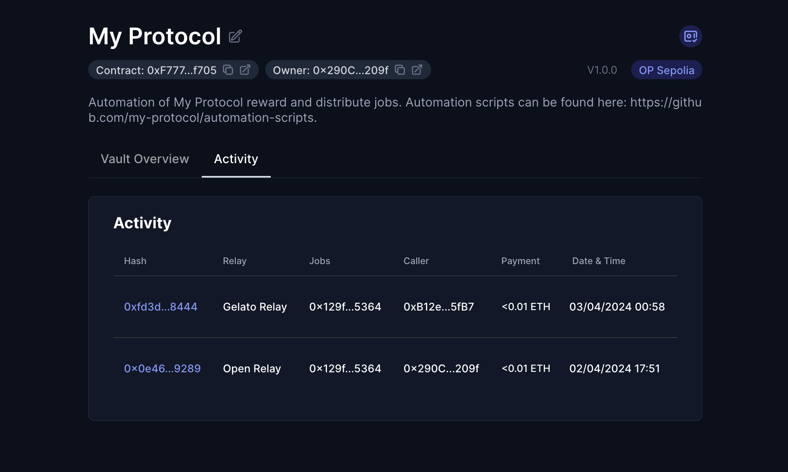

# Enable the GelatoRelay on your Vault

> 🚧 Prerequisite: Please ensure you have completed the [Automation Vault setup](./automation_vault.md) before proceeding.

The Gelato Relay enables you to connect Gelato Network to the array of automation networks in xKeeper.

Gelato offers differentiated incentives depending on the chain being used.For comprehensive details, refer to their [documentation](https://docs.gelato.network/web3-services/vrf/pricing-and-rate-limits#transaction-charges).

## Step 1: Add the relay in your vault

Inside your vault, find and click "Add New Relay," then choose Gelato Relay from the list.

In the Callers section of the window that appears, you will need to approve the dedicated msg.sender from Gelato. You can find your dedicated msg.sender inside [Gelato settings](https://app.gelato.network/settings).

Next, in the Jobs section, input the details of your job. For this guide, we will use a sample job we've made available on all testnets:

> Job Address: `0x129f5C4Adf38a1860e54DE46970653465A605364`
>
> Work function: `work (0x322e9f04)`

Now proceed by confirming in order to submit the transaction.

<video controls width="1280">
  <source src="../../media/how-to/gelato_relay/setup.mp4" type="video/mp4">
  <source src="../../media/how-to/gelato_relay/setup.webm" type="video/webm">
  Your browser does not support the video tag.
</video>

## Step 2: Create the task inside Gelato

Open your web browser and navigate to [Gelato](https://app.gelato.network/functions?type=tasks). Connect your wallet and click on "Create task".

For the purposes of this guide, we'll apply the following settings:

* Time Interval: 5 minutes
* Start Immediately: true
* Trigger: Solidity function

In the trigger settings:

* Solidity Function
  * Network: Testnet of your choosing.
  * Contract Address: Smart contract with integrated [checker](https://docs.gelato.network/web3-services/web3-functions/quick-start/writing-solidity-functions#id-1.-understand-the-role-of-a-checker). We will use a simple one deployed by us for this guide: `0x6F3f27a48Da92100Bc1b34c1FAA5e268f4bDdFDe`. 
* Target Smart Contract
  * Contract Address: Address of your job. For this guide, we will use a sample job we've made available on all testnets: `0x129f5C4Adf38a1860e54DE46970653465A605364`.

Lastly, in the "Task Properties" section under "Advanced Settings" toggle on "Transaction pays itself" to ensure the transaction costs are covered onchain through your Automation Vault.

You can learn more about each setting by visiting [Gelato documentation](https://docs.gelato.network/web3-services/web3-functions).

<video controls width="1280">
  <source src="../../media/how-to/gelato_relay/task.mp4" type="video/mp4">
  <source src="../../media/how-to/gelato_relay/task.webm" type="video/webm">
  Your browser does not support the video tag.
</video>

## Step 3: Verify execution

After the first work transaction is included onchain, you will be able to find its details under the Activity tab if your vault.

