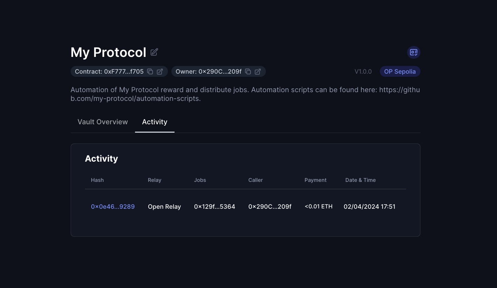

# Enable the OpenRelay on your Vault

> 🚧 Prerequisite: Please ensure you have completed the [Automation Vault setup](./automation_vault.md) before proceeding.

The OpenRelay is a fundamental yet potent relay system. It precisely calculates the gas used for executing your job within its smart contract, reimbursing the executor in ETH for the gas costs, plus an additional incentive.

**Current incentive:** **120%** of the gas costs, paid out in ETH instantaneously.

## Step 1: Enable the relay in your vault

Inside your vault, find and click "Add New Relay," then choose Open Relay from the list.

In the Callers section of the window that appears, activate the "Allow any caller" option to permit any address to execute your job.

Next, in the Jobs section, input the details of your job. For this guide, we will use a sample job we've made available on all testnets:

> Job Address: `0x129f5C4Adf38a1860e54DE46970653465A605364`
>
> Work function: `work (0x322e9f04)`

Now proceed by confirming in order to submit the transaction.

<video controls width="1280">
  <source src="../../media/how-to/open_relay/setup.mp4" type="video/mp4">
  <source src="../../media/how-to/open_relay/setup.webm" type="video/webm">
  Your browser does not support the video tag.
</video>

## Step 2: Generate exec parameters

Execution of jobs through Relays requires specific data for the exec function on the Open Relay.

Jobs should always be executed through Relays. In this case, we need to generate the data needed to call the `exec` function on the Open Relay.

Let's gather the needed information:

#### `_automationVault`

Your vault's address.

#### `_execData`

This encapsulates the encoded function signature of your job and its parameters. A typical `_execData` example is as follows:

```json
[{ "job": "<JOB_ADDRESS>", "jobData": "<JOB_DATA>" }]
```

Continue using the testnet sample job address: `0x129f5C4Adf38a1860e54DE46970653465A605364`.

To generate the job data, we will use [chisel](https://book.getfoundry.sh/chisel/):

```bash
> chisel
> bytes32(abi.encodeWithSignature("work()"))

Type: bytes32
└ Data: 0x322e9f0400000000000000000000000000000000000000000000000000000000
```

For alternative methods to generate `_execData`, refer to [Relay exec data](./exec_data.md).

#### `_feeRecipient`

The ETH fee recipient, typically the wallet executing the job.

## Step 3: Work your job for the first time

While this process is usually automated, we'll manually execute the job through Etherscan for demonstration purposes.

Visit the Etherscan page for your chosen testnet and locate the OpenRelay address listed on your vault's homepage.

Then, under the Write Contracts tab, input the parameters prepared in Step 2 and confirm the transaction.

<video controls width="1280">
  <source src="../../media/how-to/open_relay/work.mp4" type="video/mp4">
  <source src="../../media/how-to/open_relay/work.webm" type="video/webm">
  Your browser does not support the video tag.
</video>

## Step 4: Verify execution

After your work transaction is included onchain, you will be able to find its details under the Activity tab if your vault.


